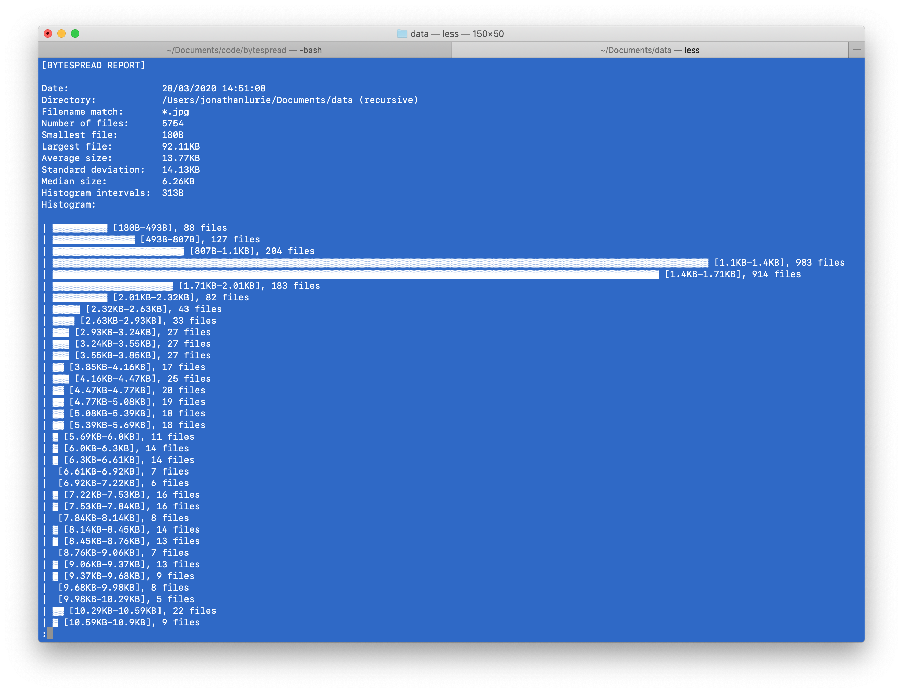
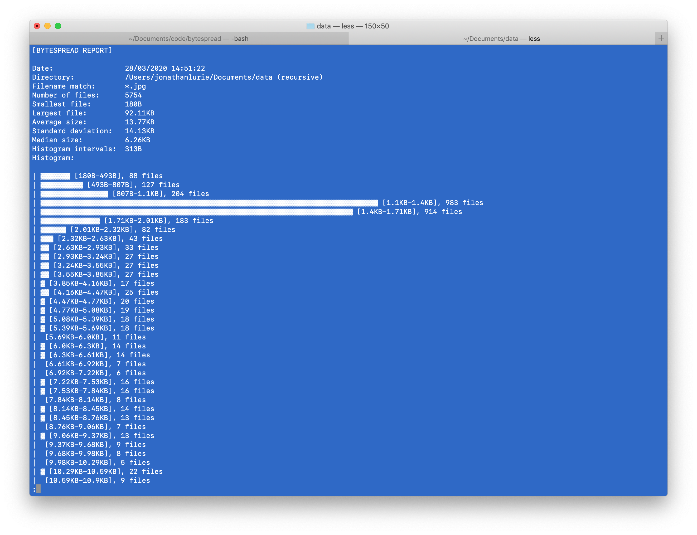
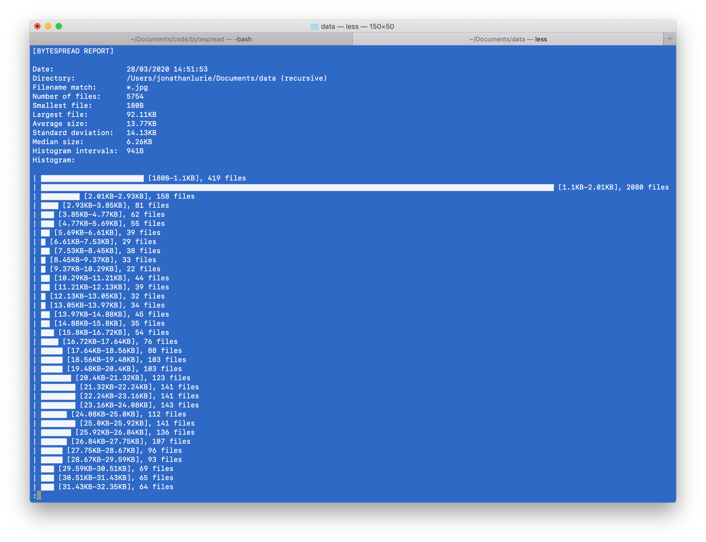

# BYTESPREAD
This is a Pythonic CLI to display histogram of file for a given directory, filename wildcard and whether the search is recursive or not. In addition, it also display some metrics such as:
- Number of files
- Smallest file
- Largest file
- Average size
- Standard deviation
- Median size

# Install
```
pip install git+https://github.com/jonathanlurie/bytespread
```

# Run
```
bytespread -d /SOME_FOLDER
```
Search options:
- `-d` the directory to look into (mandatory)
- `-r` recursive (optional, otherwise, it is not recursive)
- `-w` wildcard for filename match (optional, default: `*`)

Display options:
- `-c` number of clusters in the histogram (optional, default: `100`)
- `-b` maximum number of bricks (optional, default: `100`)

Example with `bytespread -d . -r -w *.jpg -c 300 -b 120`:  


Example with `bytespread -d . -r -w *.jpg -c 300 -b 80`:  


Example with `bytespread -d . -r -w *.jpg -c 100 -b 120`:  

